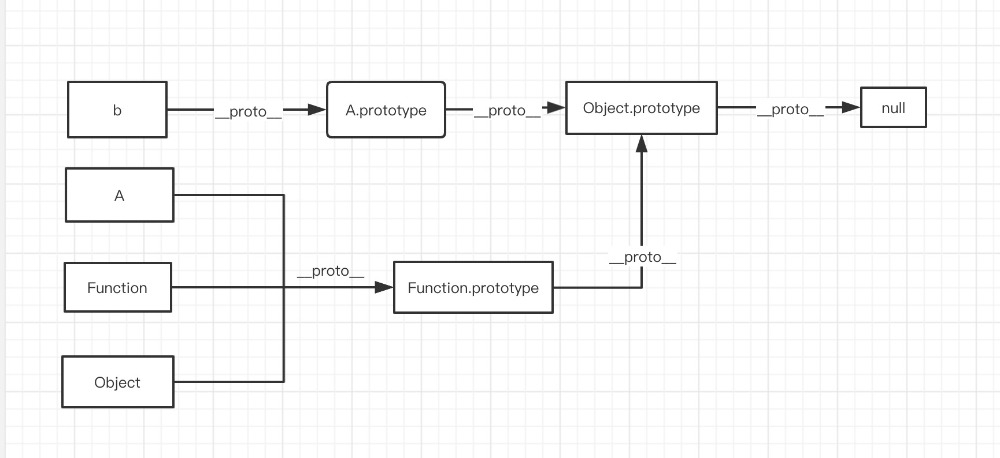

## 原型链

JavaScript 只有一种结构：对象。
每个实例对象（object ）都有一个私有属性（称之为__proto__）指向它的原型对象（prototype)。
该原型对象也有一个自己的原型对象(__proto__) ，层层向上直到一个对象的原型对象为 null。根据定义，null 没有原型，并作为这个原型链中的最后一个环节。

## 基于原型链的继承

JavaScript 对象是动态的属性“包”（指其自己的属性）。
JavaScript 对象有一个指向一个原型对象的链。当试图访问一个对象的属性时，
它不仅仅在该对象上搜寻，还会搜寻该对象的原型，以及该对象的原型的原型，依次层层向上搜索，直到找到一个名字匹配的属性或到达原型链的末尾。

> 从 ECMAScript 6 开始, `[[Prototype]]` 可以通过 `Object.getPrototypeOf()` 和 `Object.setPrototypeOf()` 访问器来访问。
这个等同于 JavaScript 的非标准但许多浏览器实现的属性 `__proto__`。

### 关于 Function

在 js 中所有的 function 我们可以看做是一个特殊的对象，这个对象可以被当做函数来执行。

```javascript

function test() {
}

// 当我们在定义了一个function的时候，这个 test 可以看做是一个对象，所有的 function 的原型链都会指向 Function.prototype
test.__proto__ === Function.prototype // true

// Function 其实自己也是一个 function，所以他的原型链也会指向 Function.prototype
Function.__proto__ === Function.prototype // true

```

### Object.create 创建的对象

ECMAScript 5 中引入了一个新方法：Object.create()。可以调用这个方法来创建一个新对象。新对象的原型就是调用 create 方法时传入的第一个参数：

```javascript


var a = {a: 1};
// a ---> Object.prototype ---> null

var b = Object.create(a);
// b ---> a ---> Object.prototype ---> null
console.log(b.a); // 1 (继承而来)

var c = Object.create(b);
// c ---> b ---> a ---> Object.prototype ---> null

var d = Object.create(null);
// d ---> null
console.log(d.hasOwnProperty); // undefined, 因为d没有继承Object.prototype

```


### 性能

在原型链上查找属性比较耗时，对性能有副作用，这在性能要求苛刻的情况下很重要。另外，试图访问不存在的属性时会遍历整个原型链。
遍历对象的属性时，原型链上的每个可枚举属性都会被枚举出来。要检查对象是否具有自己定义的属性，
而不是其原型链上的某个属性，则必须使用所有对象从Object.prototype继承的 hasOwnProperty 方法。

> hasOwnProperty 是 JavaScript 中处理属性并且不会遍历原型链的方法之一。(另一种方法: Object.keys())

### 案例

```javascript

function A() {
}

var b = new A();

```

根据上面的例子，下面是 A, b ,Object,Function 相互之间的关系




